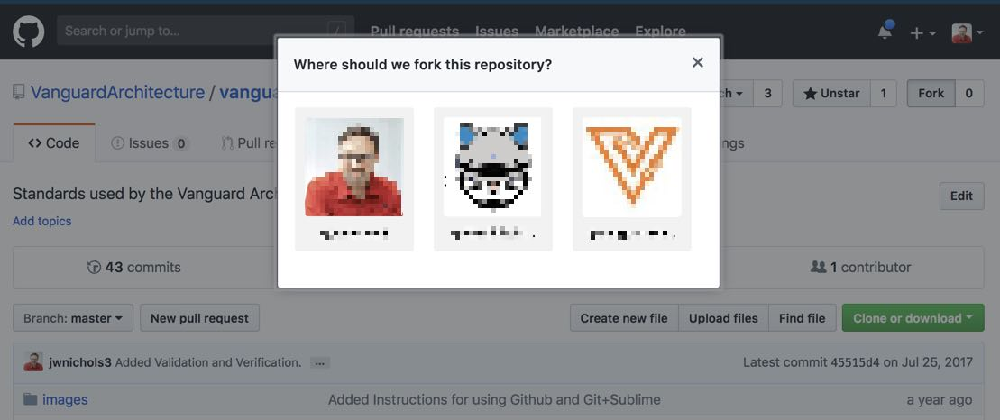
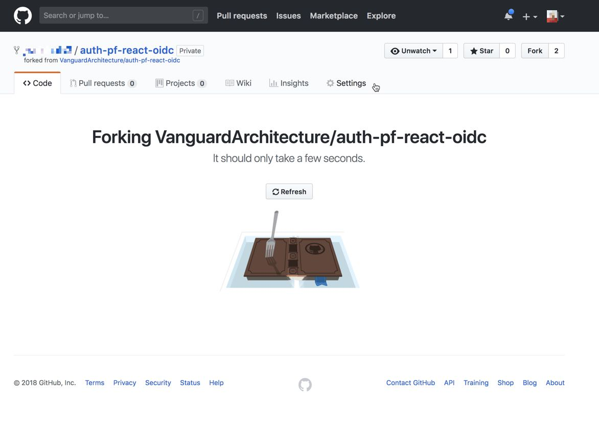
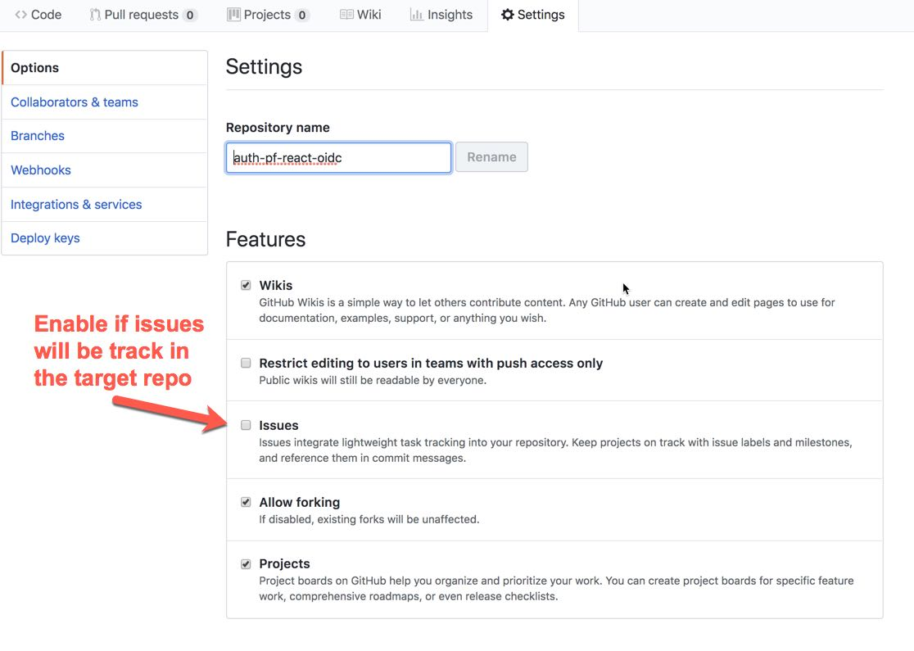
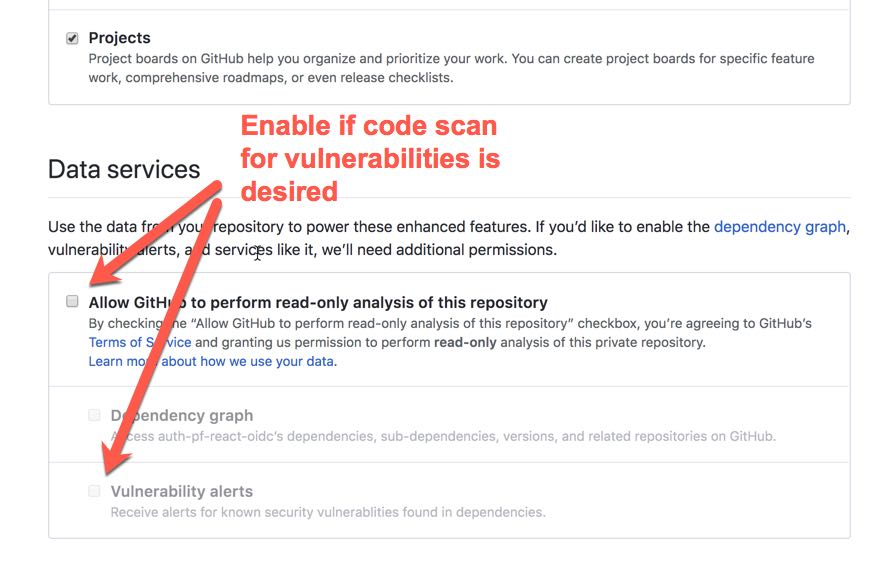

# Introduction

Forking from the VanguardArchitecture repo to other repos helps with the providence of the code and ideas.

# Process

* Navigate the source repo.
* Choose Fork
* Pick the target Org
* Review and edit the repo settings in the Target Org
    * If Issues to be tracked indpendently of source Repo
    * If Vulnerability and Dependency tracking is required.

