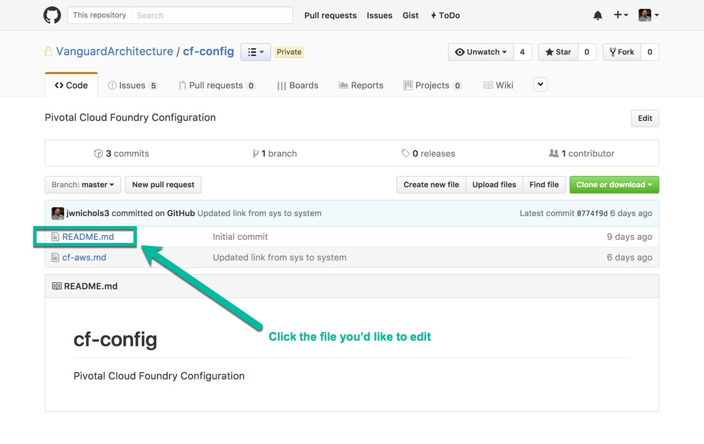
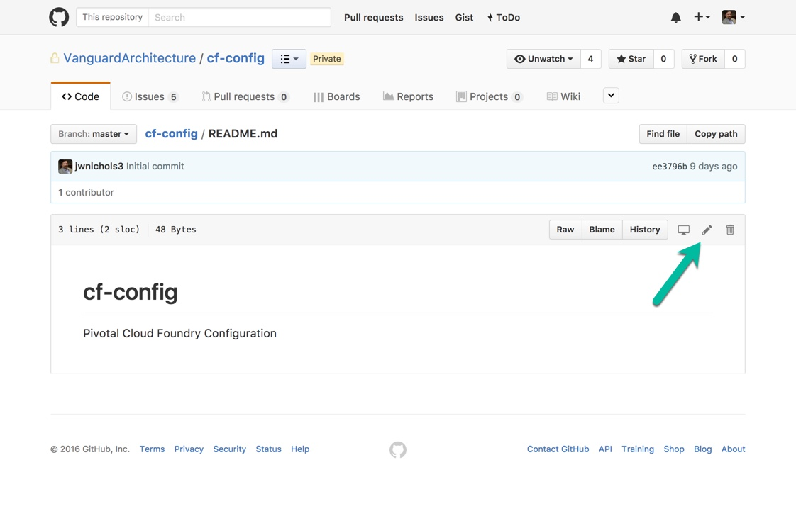
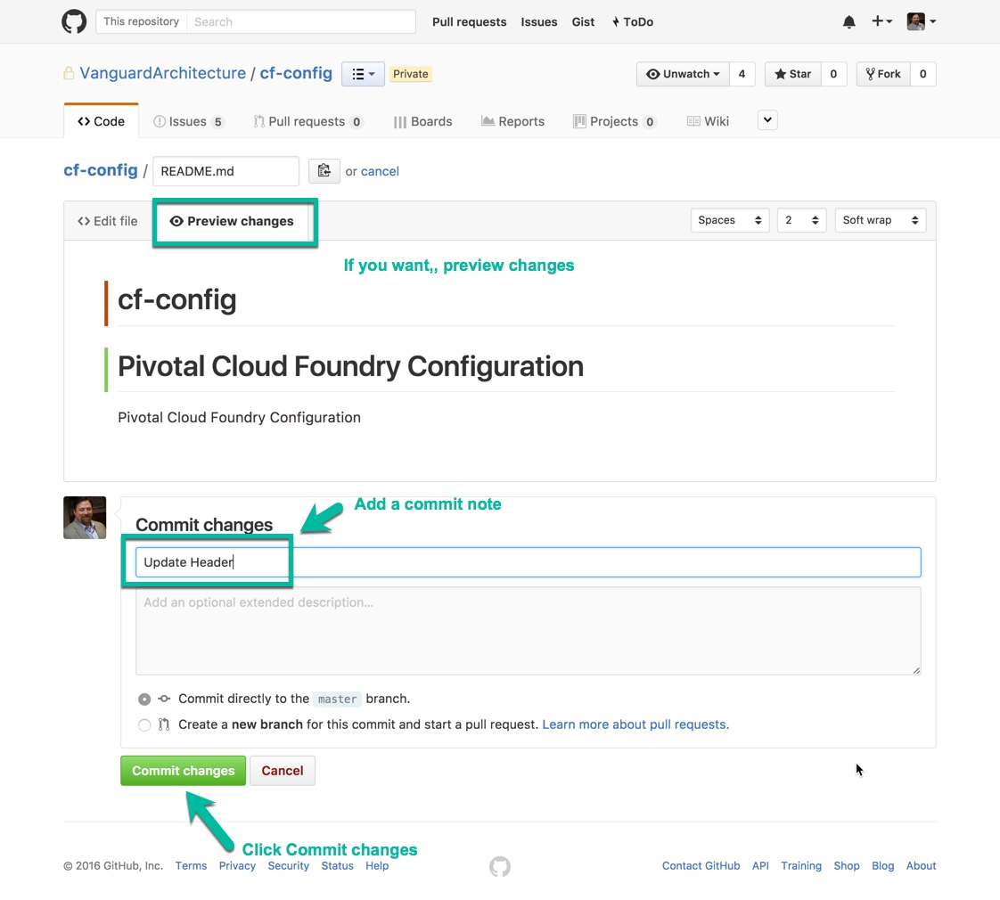
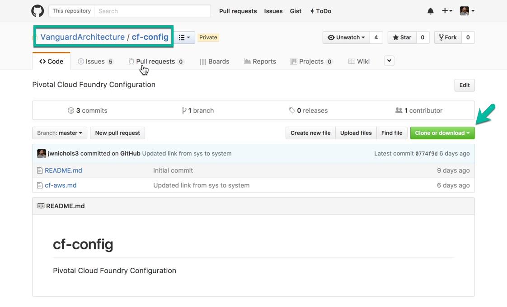
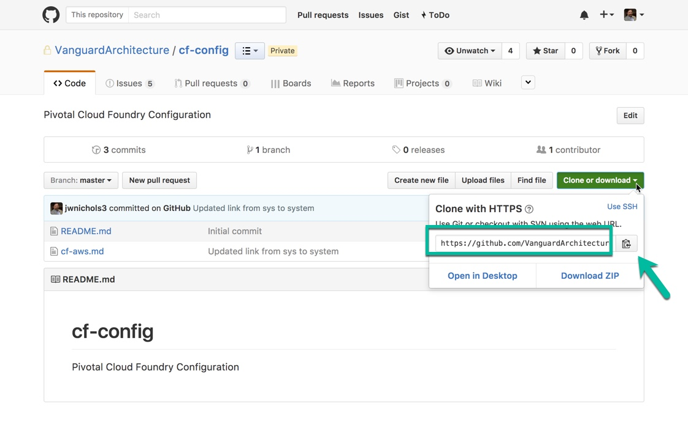

# Simple Instructions for Github, Git + Sublime

These are instructions on how to navigate Git for simple updates. It doesn't address branching, merging, conflicts or any of the advanced items.

[Alt A: Github Edit](#alt-a-edit-on-github)

[Alt B: CLI + Sublime](#alt-b-command-line--sublime)

## Alt A: Edit on Github

### Navigate to the Repo



### Select the File to Edit



### Edit the File


### Commit Changes



## Alt B: Command Line / Sublime

### Navigate to the Repo you want to use



### Copy the Repo Address



### Open a terminal or command line, navigate to your local code folder.

### Git Clone the Repo

Example:
```
git clone https://github.com/VanguardArchitecture/cf-config.git
```

### Use Sublime to make Changes
Or use whatever editor you'd like to use.

### Use git commands to commit

```
git add .
git commit -m "Your message here"
git push
```


