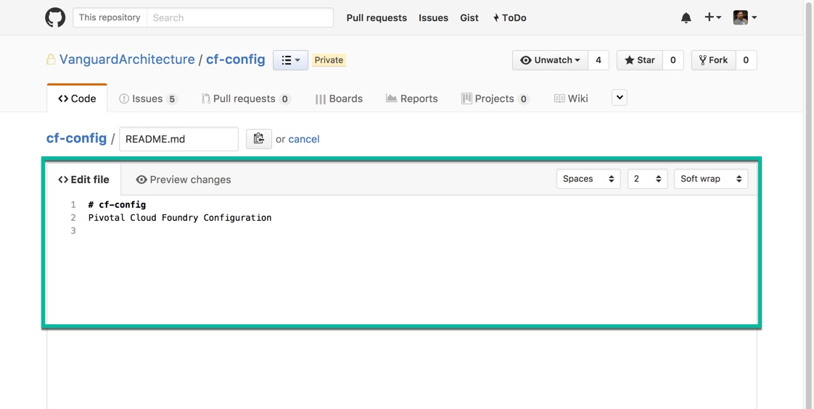
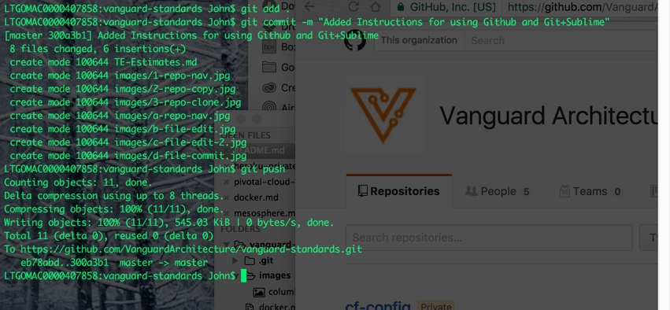

# Simple Instructions for Github, Git + Sublime

These are instructions on how to navigate Git for simple updates. It doesn't address branching, merging, conflicts or any of the advanced items.

[Alt A: Github Edit]
[Alt B: CLI + Sublime]

## Alt A: Edit on Github

1. Navigate to the Repo


2. Select the File to Edit


3. Edit the File



4. Commit Changes


## Alt B: Command Line / Sublime

1. Navigate to the Repo you want to use


2. Copy the Repo Address


3. Open a terminal or command line, navigate to your local code folder.

4. Git Clone the Repo

Example:
```
git clone https://github.com/VanguardArchitecture/cf-config.git
```

5. Use Sublime to make Changes

6. Use git commands to commit

```
git add .
git commit -m "Your message here"
git push
```


